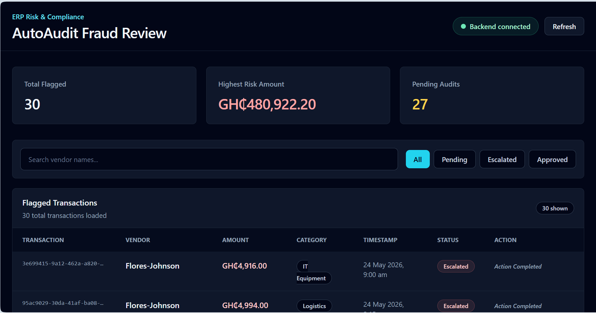

# 🛡️ AutoAudit MVP

An unsupervised machine learning project that catches suspicious transactions in company financial ledgers before payouts go out. Built as a full-stack prototype using Python, Scikit-Learn, FastAPI, and Tailwind CSS.

---

## 📌 The Idea & Motivation

When looking into how corporate financial auditing works, I realized a major flaw: **most traditional audits rely on manual sampling**. An auditor might only inspect 5% of a company's transaction logs because going through thousands of rows by hand is impossible. This leaves a massive blind spot for sneaky financial schemes—like splitting a $15,000 transfer into three $4,900 payments to dodge manager approval limits, or making high-value transfers at 2 AM.

I built **AutoAudit** to solve this. Instead of sampling 5%, it scans **100% of the ledger in real time** using unsupervised machine learning, flagging high-risk transactions so auditors can focus only on what looks wrong.

---

## 💡 How It Works

1. **Synthetic Data Engine (`generate_data.py`):** Generates 1,000 realistic company transaction logs and injects 30 fraud patterns (split payments, off-hour transfers, value outliers).
2. **Feature Engineering (`detect_anomalies.py`):** Calculates temporal metrics like payment hours and rolling 24-hour vendor transaction counts to spot velocity spikes.
3. **Isolation Forest Model:** Uses unsupervised decision trees to isolate rare, out-of-place transactions without needing pre-labeled training data.
4. **FastAPI Backend (`main.py`):** Exposes clean REST endpoints (`/api/anomalies`) serving filtered JSON payloads.
5. **Auditor Dashboard (`index.html`):** A lightweight web interface that fetches flagged rows in real time and ranks them by risk score.

---

## 📊 Evaluation & Test Results

I evaluated the model against a 1,000-record test ledger with 30 known injected fraud cases:

* **Precision:** 83.33%
* **Recall:** 83.33%
* **F1-Score:** 83.33%

**What the Confusion Matrix told me:**
* **25 True Positives:** Caught 25 out of the 30 fraud cases.
* **5 False Positives:** Flagged 5 clean transactions that looked unusual (e.g., valid bulk payments).
* **965 True Negatives:** Successfully passed normal operational transactions.
* **5 False Negatives:** Missed 5 subtle fraud cases that blended too closely into normal spending behavior.

*Out of 1,000 total rows, the model cut down the auditor's workload to just 30 high-priority flags—reducing manual review time by over 95%.*

---



---

## 🛠️ Tech Stack

* **Language:** Python
* **Data Science & ML:** Pandas, Scikit-Learn, NumPy
* **Backend:** FastAPI, Uvicorn
* **Frontend:** HTML5, Tailwind CSS, JavaScript (Fetch API)

---

## 🚀 How to Run It Locally

### 1. Clone the repo
```bash
git clone https://github.com/nk-yeboah/autoaudit-mvp.git
cd autoaudit-mvp 
```

---

### 2. Set up a virtual environment
```bash
# Windows
python -m venv venv
venv\Scripts\activate

# Mac/Linux
python3 -m venv venv
source venv/bin/activate
```

---

### 3. Install requirements
```bash
pip install -r requirements.txt
```

### 4. Generate data & run the ML model
```bash
python generate_data.py
python detect_anomalies.py
```

---

### 5. Start FastApi server
```bash
uvicorn main:app --reload
```

---

### 6. Check out the dashboard
* Open `index.html` in your browser to view the auditor dashboard.
* Head over to `http://127.0.0.1:8000/docs` to test the interactive API endpoints.

---

## 🛣️ What I Want to Improve Next

Since this is an early MVP, here are a few things I plan to add down the line:
* Replace static CSV persistence with a **PostgreSQL** database using SQLAlchemy.
* Add **OAuth2 JWT authentication** so only logged-in compliance managers can clear flags.
* Connect a real-time event broker like **Apache Kafka** to score stream transactions on the fly.

---

## 📄 License

Distributed under the MIT License.
